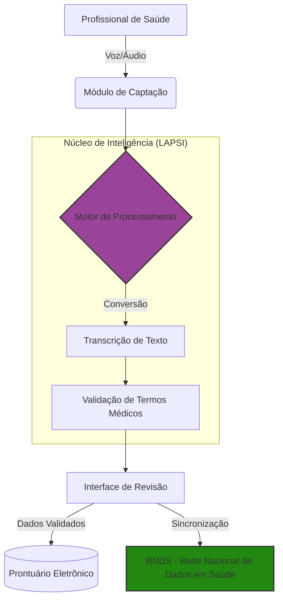

#### Descrição dos Componentes (Arquitetura)

O projeto segue uma arquitetura baseada em microserviços/módulos para processamento de áudio e integração com dados de saúde:

1. Interface de Captura (Frontend/Cliente) - Módulo responsável por captar o áudio do profissional de saúde (médicos/enfermeiros) em tempo real.

2. Motor de Reconhecimento de Fala (Speech-to-Text) - Utiliza modelos de Deep Learning (comumente baseados em bibliotecas como TensorFlow/PyTorch ou APIs como Whisper) para converter o sinal sonoro em texto.

3. Módulo de Validação Clínica - Um componente de inteligência que analisa o texto transcrito em busca de termos médicos e verifica a consistência dos dados conforme eles são ditados.

4. Integração RNDS (Rede Nacional de Dados em Saúde) - Módulo de saída que formata o texto processado para os padrões exigidos pelos Sistemas de Informação em Saúde brasileiros.

5. Banco de Dados/Armazenamento - Repositório para logs, modelos de áudio treinados e históricos de transcrição.

[](LICENSE)

# Fala-Texto

Sistema de conversão de fala em texto para documentação clínica. Profissionais de saúde gravam informações por voz e o sistema transcreve, valida e preenche automaticamente formulários médicos em PDF.

---

## Sumário

- [Visão Geral](#visão-geral)
- [Arquitetura](#arquitetura)
- [Estrutura do Repositório](#estrutura-do-repositório)
- [Componentes](#componentes)
  - [App Android — Kotlin (principal)](#app-android--kotlin-principal)
  - [Backend FastAPI](#backend-fastapi)
  - [Fine-Tuning do Whisper](#fine-tuning-do-whisper)
  - [App Kivy (legado)](#app-kivy-legado)
- [Instalação do APK (usuário final)](#instalação-do-apk-usuário-final)
- [Licença](#licença)

---

## Visão Geral

<div align="center">
  
</div>

O Fala-Texto foi desenvolvido para reduzir a carga de trabalho de profissionais de saúde no preenchimento de documentos clínicos. Com ele é possível:

- Gravar informações por voz diretamente no ambiente hospitalar
- Transcrever automaticamente o áudio usando o modelo Whisper
- Validar terminologia clínica em tempo real durante o preenchimento
- Popular campos de formulários PDF sem digitação manual

---

## Arquitetura


O fluxo de processamento é modular e linear:

1. **Captura** — microfone do dispositivo Android grava o áudio
2. **Pré-processamento** — filtragem de ruído, redução de interferências e detecção de atividade de voz
3. **Reconhecimento de fala** — modelo Whisper converte o áudio em texto bruto
4. **Tratamento de texto** — normalização, pontuação, correção ortográfica, mapeamento de termos clínicos e validação semântica
5. **Preenchimento** — texto validado é inserido automaticamente nos campos do formulário PDF, com feedback ao usuário e controles de segurança


Arquitetura alto nível da solução:



## Estrutura do Repositório

| Pasta | Descrição |
|-------|-----------|
| `App-Kotlin/VoiceSurgeryWhisper/` | App Android principal (Kotlin + Retrofit2 + Jetpack) |
| `App-Kotlin/VoiceSurgeryGoogleAPI/` | Versão alternativa usando o SpeechRecognizer nativo do Android |
| `a-transcricao/backend/` | Backend principal (FastAPI + Whisper turbo + GPU) |
| `servico-transcricao/API/` | Backend legado em Flask (mantido como referência) |
| `Fine-Tuning/` | Scripts para fine-tuning do Whisper com dados clínicos em português |
| `App-kivy/` | Protótipo legado em Python/Kivy |
| `Instalação (APK)/` | Guia de instalação do APK para usuários finais |

---

## Componentes

### App Android — Kotlin (principal)

O stack **Android Studio + Kotlin** é a solução preferencial após testes em ambiente hospitalar. Oferece:

- Interface nativa com melhor desempenho e UX
- Acesso direto às APIs do sistema (microfone, segurança)
- Suporte a Jetpack Compose para interfaces reativas
- Ferramentas integradas de profiling, testes e CI/CD

**Como compilar e executar:**

```bash
cd App-Kotlin/VoiceSurgeryWhisper

./gradlew assembleDebug          # Gera APK de debug
./gradlew assembleRelease        # Gera APK de release
./gradlew installDebug           # Instala no dispositivo/emulador conectado
./gradlew test                   # Testes unitários
./gradlew connectedAndroidTest   # Testes instrumentados
```

> Requisitos: minSdk 28, targetSdk 36, Kotlin JVM target 11, heap JVM 2 GB.

---

### Backend FastAPI

O backend recebe o áudio do app, realiza a transcrição com Whisper e devolve o texto normalizado para preenchimento do PDF.

**Execução local:**

```bash
cd servico-transcricao/backend
pip install -r requirements.txt
uvicorn servico:app --host 0.0.0.0 --port 3050
```

**Docker (produção com GPU):**

```bash
docker build -t transcricao-api .
docker run -d -p 3050:3050 --restart always -m 6g --gpus all \
  -v /path/to/volume:/app/imagens transcricao-api
```

**Estrutura do código:**

```
app/
├── __init__.py          — factory create_app()
├── config.py            — configurações (JWT, CORS, pastas, thresholds)
├── dependencies.py      — limiter, pwd_context, usuários
├── exceptions.py        — handlers de rate limit e JWT
├── models.py            — LoginModel
├── services/
│   ├── audio_service.py — Whisper + pré-processamento + métricas de qualidade
│   ├── pdf_service.py   — operações com PyMuPDF
│   ├── face_service.py  — verificação com DeepFace/FaceNet
│   └── field_mapping.py — mapeamento CSV→PDF (50 condições)
└── routers/
    ├── auth.py          — GET /, POST /login
    ├── audio.py         — POST /transcricao
    ├── face.py          — POST /autenticacao, /upload-imagem
    └── pdf.py           — POST /listar-campos, /preencher-campos, /imagem, /preencher-pdf
```

O proxy reverso Nginx está configurado em `servico-transcricao/backend/processarpdffalatex.zapto.org.conf`.

---

### Fine-Tuning do Whisper

Scripts para ajuste fino do modelo Whisper com dados clínicos em português, melhorando a precisão na transcrição de termos médicos.

```bash
cd Fine-Tuning
python -m venv venv && source venv/bin/activate
pip install -r requirements.txt

python Transformers.py    # Treina o modelo (requer GPU)
python Avaliarmodelo.py   # Avalia com a métrica WER
```

> Antes de treinar, insira seu token do Hugging Face na função de login do `Transformers.py`.
> Para avaliação, defina `MODEL_PATH` (pasta do modelo treinado) e `AUDIO_FILE_PATH` (arquivos de áudio de teste).

---

### App Kivy (legado)

Protótipo inicial desenvolvido em Python com o framework [Kivy](https://kivy.org), mantido apenas como referência. O build para Android usa o Buildozer:

```bash
cd App-kivy
buildozer init           # Inicializa configuração
buildozer -v android debug    # Gera APK de debug
buildozer -v android release  # Gera APK de release
```

> Limitações: interface menos nativa, maior complexidade de build e acesso limitado a APIs do sistema em comparação com o app Kotlin.

---

## Instalação do APK (usuário final)

Para instalar o app sem passar pela Play Store:

1. Baixe o arquivo `.apk` da pasta `Instalação (APK)/` ou `App-Kotlin/VoiceSurgeryGoogleAPI/apk+pdf/`
2. No GitHub, use o botão **"View Raw"** ou **"Download"** para baixar o arquivo
3. No dispositivo Android, acesse a pasta **Downloads** e toque no arquivo `.apk`
4. Se solicitado, habilite a instalação de **fontes desconhecidas** nas configurações de segurança
5. Confirme a instalação e conceda a permissão de gravação de áudio ao abrir o app pela primeira vez

> O sistema pode exibir um alerta de segurança pois o app é um protótipo e não está publicado na Play Store. Isso é esperado.

---

## Licença

Distribuído sob a licença [Apache 2.0](LICENSE).
>>>>>>> Stashed changes
